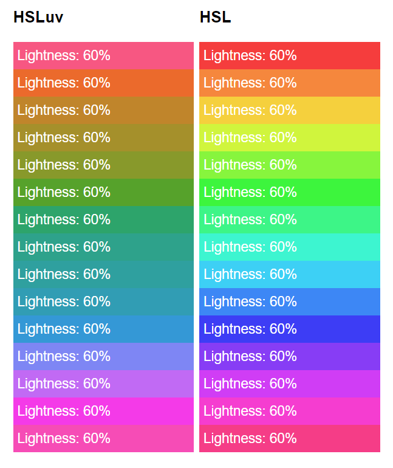

# hsluv_ts

<div id="intro">

An HSLuv implementation in typescript, ported from the [definitive reference
Haxe version](https://github.com/hsluv/hsluv).

MIT licensed.

 [](https://github.com/StoneCypher/hsluv_ts/actions)

  

➡️ [Site](https://stonecypher.github.io/hsluv_ts/)

➡️ [Generated library documentation](https://stonecypher.github.io/hsluv_ts/docs/)

</div>


<br/><br/>

## What is this?

Chances are you already know what `HSLuv` (formerly aka `HuSL`) is if you're
here, but if not, [`HSLuv` is a color scale meant to be easy for humans to
interpret](https://www.hsluv.org/).  This package primarily exists to implement
two color spaces: `HSLuv` and `HPLuv`.  However, in the process, we also
implement transformations for `rgb` in numeric, `rgb` in hex strings, `hsl`,
`xyz`, `luv`, and `lch`, as well as the `lightness` to `y channel` transform in
both directions.


<br/>

### HSLuv

What's interesting about `HSLuv` is that the apparent brightness is normalized.
If you've tried to pick color palettes in the regular `HSL` space, you've
probably noticed that at the same `lightness`, the colors in the blue end of the
`hue` appear far darker than the colors in the yellow end.

`HSLuv` fixes that.  For any given `hue`, the apparent brightness of a given
`lightness` is meant to be simiar (using a whole bunch of complicated math and
human measurement.)

From [Alexei's page](https://hsluv.org/comparison/),




<br/>

### HPLuv

The downside of `HSLuv` is that there are colors it can't represent.  There is
no blue with the apparent brightness of canary yellow.

`HPLuv` makes these work by sacrificing saturation correctness.  `HPLuv` will
always produce a color, but sometimes a less satisfying one than `HSLuv`.


<br/><br/>

## How to use

```
npm install --save-dev hsluv_ts
```

```typescript
import { hsluv_to_hex, hsluv_to_rgb, hex_to_hsluv } from 'hsluv_ts';

console.log( hsluv_to_hex([ 250, 50, 50 ]) );
// prints "#5c78a5"

console.log( hsluv_to_rgb([ 250, 50, 50 ]) );
// prints [ 0.35957778969721066, 0.4708793745621595, 0.6462180065016022 ]

console.log( hex_to_hsluv('#5c78a5') );
// prints [ 250.2650513570262, 49.70313649414815, 50.00687151772391 ]
```


<br/><br/>

## API

[The following functions are exposed](https://stonecypher.github.io/hsluv_ts/docs/modules/_hsluv_.html).

All functions take two arguments, according to the types in their names.

* `rgb_to_hsluv`
* `rgb_to_hpluv`
* `hsluv_to_rgb`
* `hpluv_to_rgb`
* `hex_to_hsluv`
* `hex_to_hpluv`
* `hsluv_to_hex`
* `hpluv_to_hex`
* `lch_to_hsluv`
* `lch_to_hpluv`
* `hsluv_to_lch`
* `hpluv_to_lch`
* `rgb_to_xyz`
* `xyz_to_rgb`
* `rgb_to_lch`
* `lch_to_rgb`
* `luv_to_xyz`
* `xyz_to_luv`
* `luv_to_lch`
* `lch_to_luv`
* `l_to_y`
* `y_to_l`
* `hex_to_rgb`


<br/>

### API Types

* `l` and `y` are `number`s.
* `hex` is a seven-character `string` starting with `#`.
    * The library consumes upper and lower case, but produces lower case.
* `hsl` and `hpl` are a tuple (array) of range `[0;360]`, `[0;100]`, `[0;100]`
* `rgb` is a tuple of range `[0;1]`, `[0;1]`, `[0;1]`
* `xyz`, `lch`, and `luv` are a tuple of three unbounded signed `number`s


<br/><br/>

## Bundling

This implementation provides `.d.ts` for Typescript, `es6` native tree-shakeable
for most work, `es6` commonjs bundled for quick work, `es6 iife` for in-browser
learning and debugging, and `es6 iife minified` for bandwidth-sensitive
prepackaged deployment like CDNs.  `main` refers to `es6 cjs`, and `module`
refers to `es6` native tree-shakeable.


<br/><br/>

## Quality

This implementation passed [the author's 24,000
tests](https://github.com/hsluv/hsluv/blob/master/snapshots/snapshot-rev4.json).
By comparison to the reference implementation, [calculations are accurate to
within 1 in 10<sup>15</sup>](https://github.com/StoneCypher/hsluv_ts/blob/master/src/ts/hsluv.test.ts#L25),
which [the author says is fine](https://github.com/hsluv/hsluv/issues/58#issuecomment-586946374).

This implementation is [CI tested](https://github.com/StoneCypher/hsluv_ts/actions)
under Node 8,12,13 on Windows, Mac, and Ubuntu.


<br/><br/>

## Changes

* Typescript.
* Names are now in `snake_case` instead of `camelCase`.
* Many tests were added in the name of code coverage.
* CI under Github Actions


<br/><br/>

## Wait, are there two of these?

I made this because Typescript wasn't on the author's somewhat extensive
language list, and because the Haxe tooling wasn't very convenient under
`rollup`.  When I was done and tried to publish, [I realized someone else
already had done this](https://www.npmjs.com/package/hsluv-ts), and even used
the same name I did; it was just missing from the author's list.

However, my approach to typing, packaging, and tooling is mildly different than
theirs, so I'm gonna publish anyway.  Besides, it's already finished (sigh 😞,)
and I like some of the differences in mine between these two projects.
